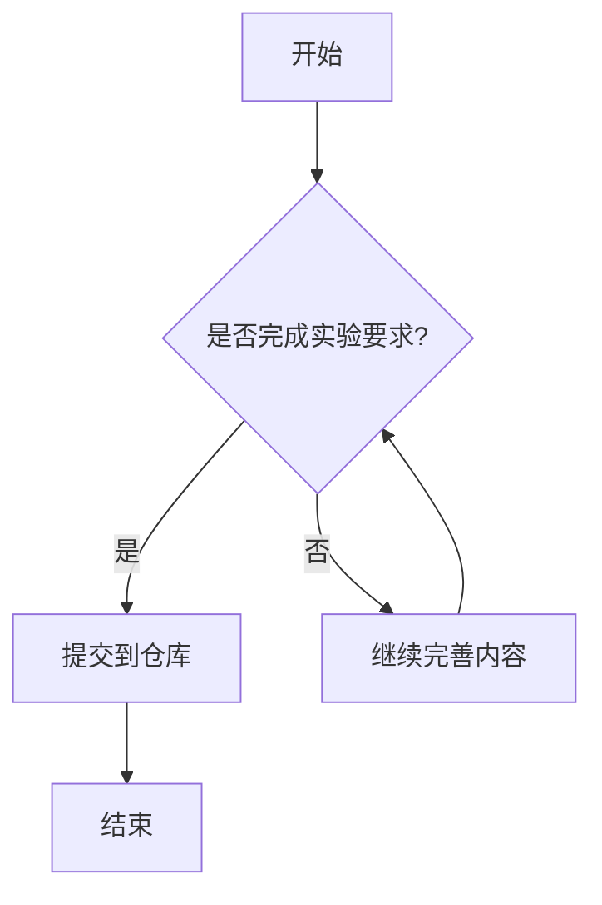

# Lab0 Markdown 练习

## 图片引用
下面是我喜欢的一张图片：


## 代码块示例（Python）
```python
def greet(name: str) -> str:
    return f"Hello, {name}!"

print(greet("OSH"))
```

## Mermaid 流程图


## TeX / LaTeX 数学公式
我最喜欢的公式是欧拉恒等式：

$$
e^{i\pi} + 1 = 0
$$
